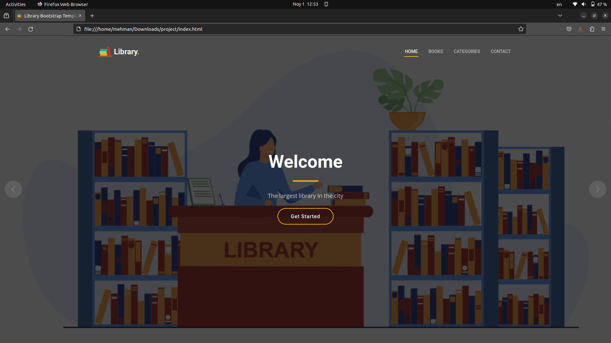
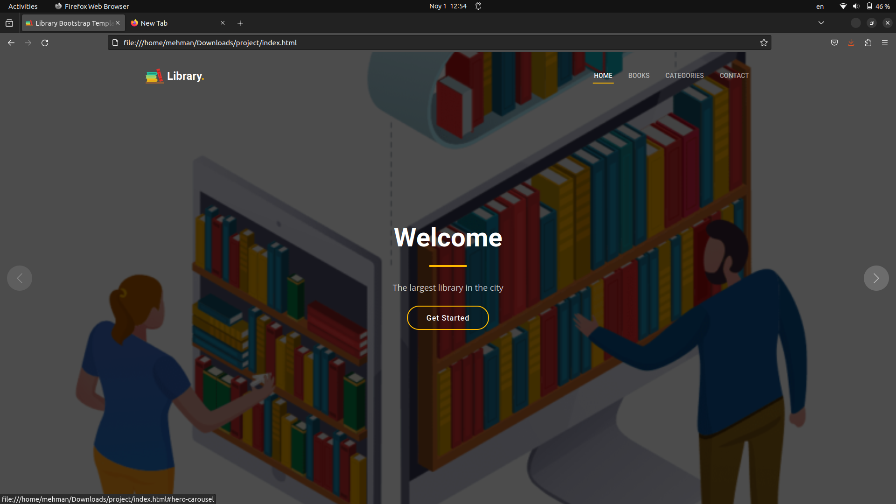
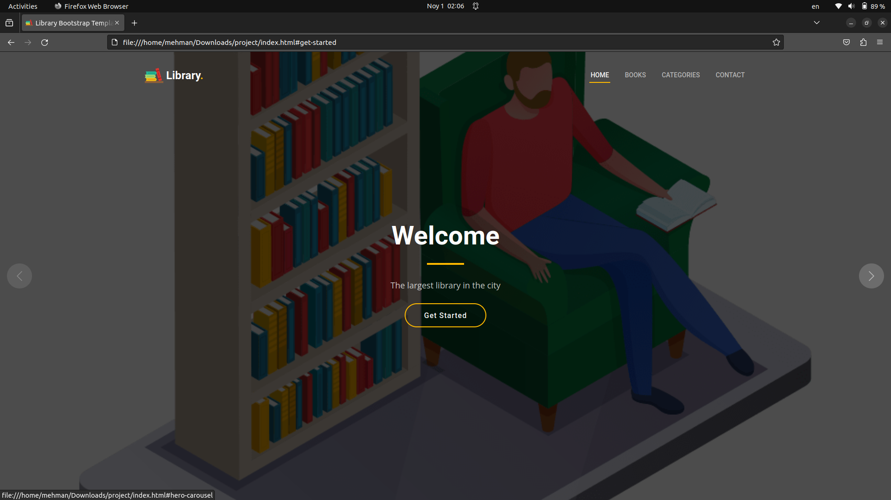
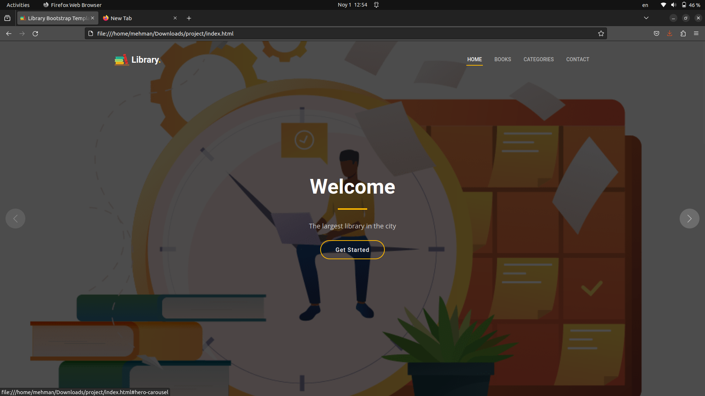
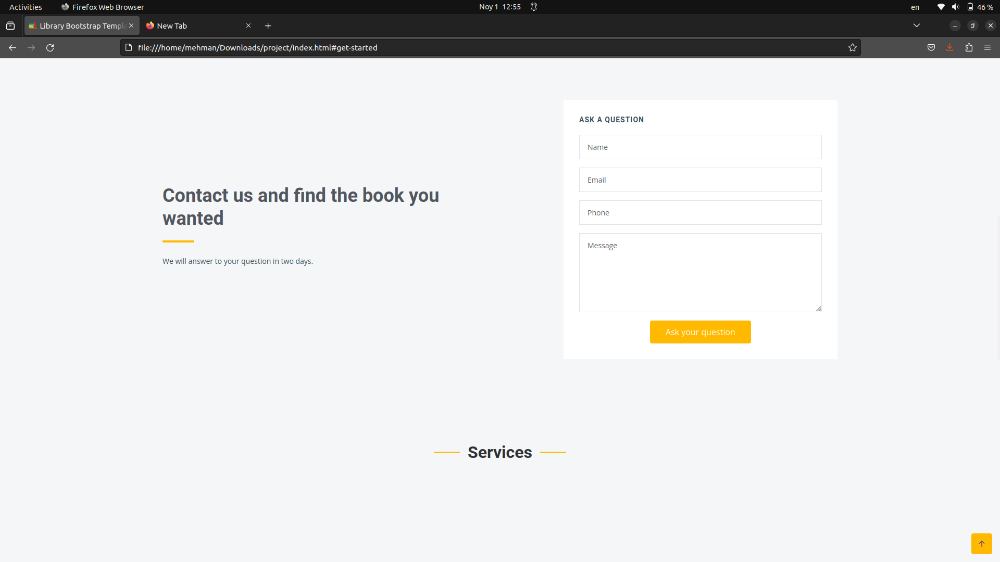
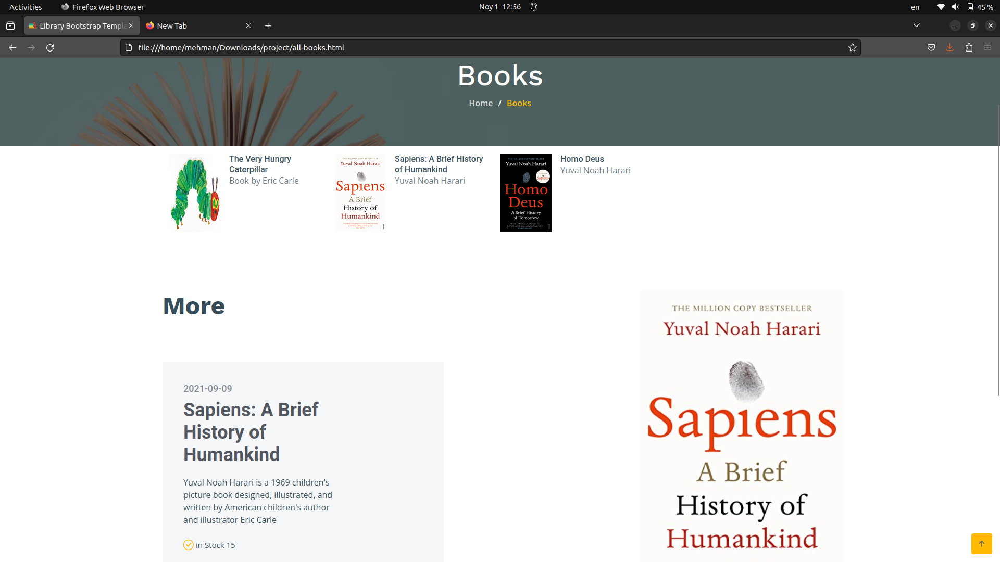
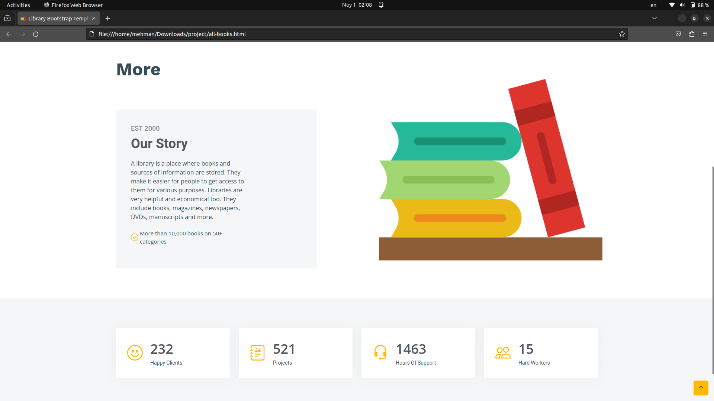
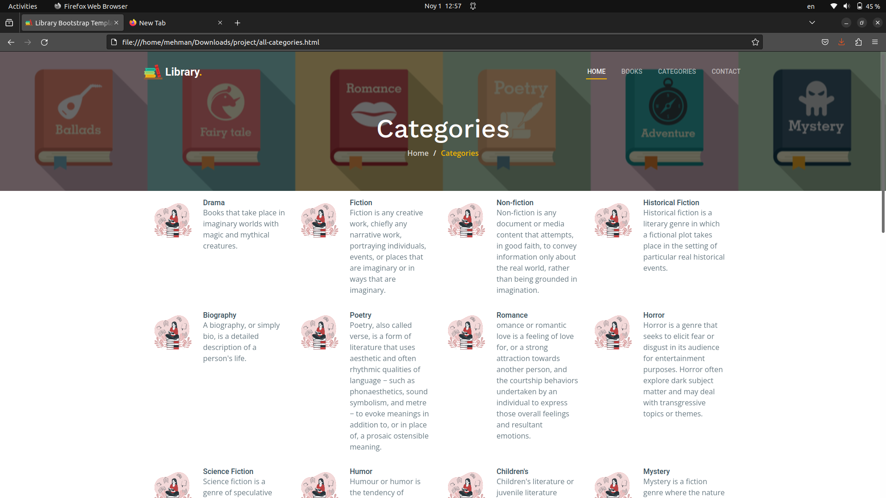
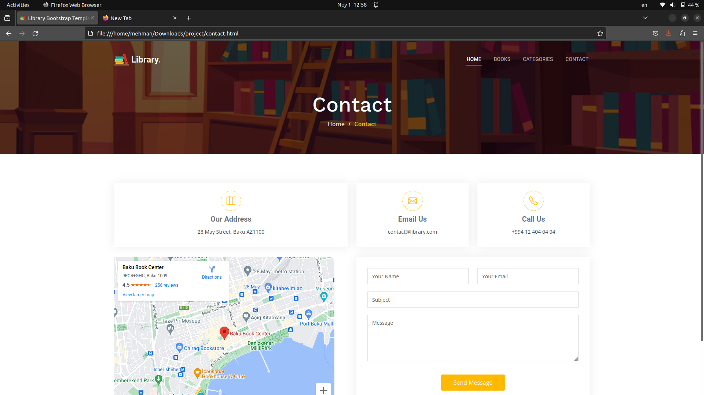

# Library Management System - L.M.S.
A library management system is a crucial tool for efficiently organizing, cataloging, and managing the resources within a library. Such a system helps librarians and library users streamline their interactions with the library's vast collection of books, periodicals, digital media, and other resources. This project aims to provide an overview of the key features and functionalities of a typical library management system.

A library management system, often abbreviated as LMS, is a software solution designed to automate the processes and tasks associated with library operations. It enables librarians and library staff to manage library resources, track borrowed items, and assist library users in finding the information they need efficiently.
# Home page of the application

## Getting started

## Showing all books

## Getting more details

## Categories

## Contact us

## Key Features:

Spring Framework: The entire project is built using the Spring framework, ensuring a modular, maintainable, and scalable architecture. Spring's various modules are employed to enhance different aspects of the application.

Spring Boot: The application is powered by Spring Boot, facilitating rapid development and deployment. The embedded server, simplified configuration, and automatic Spring dependency management streamline the development process.

JWT Authentication and Authorization: JSON Web Tokens (JWT) are utilized for secure user authentication and authorization. This ensures that only authorized users can access sensitive parts of the application.

Spring AOP (Aspect-Oriented Programming): Spring AOP is employed for cross-cutting concerns such as logging, auditing, and security. This results in cleaner and more maintainable code by separating concerns.

Spring Security: The application integrates Spring Security to manage authentication, authorization, and protection against common security vulnerabilities.

Hibernate and JPA: Hibernate, an industry-standard Object-Relational Mapping (ORM) framework, combined with Java Persistence API (JPA), is used for efficient database operations. This allows seamless interaction with the underlying PostgreSQL database.

PostgreSQL: The project utilizes PostgreSQL, a powerful open-source relational database, to store and manage user and job data securely.

Liquibase: Database schema management is handled using Liquibase, enabling smooth database versioning and migration as the application evolves.

Mail Sending: The application incorporates email sending functionality to notify users about job application updates, new job listings, and other important events.

Mapper: The Mapper library is used to simplify the conversion of complex data objects, such as DTOs (Data Transfer Objects), between different layers of the application.

## Contributions
Contributions to this project are welcome! If you find any issues or have suggestions for improvements, feel free to open an issue or submit a pull request
